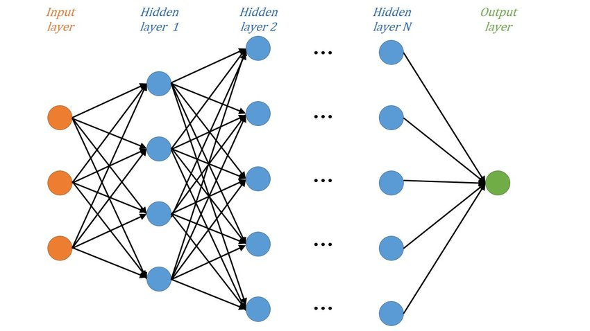

# 1. Deep Learning

## 1. 머신러닝과 딥러닝의 차이
- 딥 러닝은 발전된 형태의 ML 방법론입니다. 모든 딥 러닝은 ML에 해당합니다.
  - [기계 학습과 딥 러닝의 차이점은 무엇인가요? AWS](https://aws.amazon.com/ko/compare/the-difference-between-machine-learning-and-deep-learning/)

  
## 2. 딥러닝이란?
- 인간의 두뇌에서 영감을 얻은 방식으로 데이터를 처리하도록 컴퓨터를 가르치는 인공 지능(AI) 방식
- 그림, 텍스트, 사운드 및 기타 데이터의 복잡한 패턴을 인식하여 정확한 인사이트와 예측을 생성.
  - [딥 러닝이란 무엇입니까? AWS](https://aws.amazon.com/ko/what-is/deep-learning/)
- [인공지능·머신러닝·딥러닝 차이점은?ㅣ개념부터 차이점까지 총 정리](https://www.codestates.com/blog/content/%EB%A8%B8%EC%8B%A0%EB%9F%AC%EB%8B%9D-%EB%94%A5%EB%9F%AC%EB%8B%9D%EA%B0%9C%EB%85%90)

## 3. 신경망
- [단일신경망](https://eskimo-igloo.tistory.com/m/363)
  - 하나의 인공 신경망 구조를 의미합니다. 
    - 하나의 네트워크가 입력 데이터를 받아들이고, 그것을 처리하여 원하는 출력을 생성하는 구조를 가집니다. 
    - 단일 신경망은 입력 레이어, 은닉 레이어(들), 출력 레이어로 구성됩니다.  
  - 단일 신경망은 입력 데이터를 받아들이고 내부적으로 가중치(weight)와 편향(bias)을 조정하여 입력과 출력 간의 관계를 학습합니다. 
    - 이러한 학습 과정은 주로 역전파(backpropagation) 알고리즘을 사용하여 수행됩니다. 
    - 단일 신경망은 주로 지도 학습(supervised learning) 및 비지도 학습(unsupervised learning) 작업에 사용됩니다.
  - 
- DNN(Deep Neural Network), CNN(Convolution Neural Network), RNN(Recurrent Neural Network) 으로 구분
  - DNN (딥 신경망)
    - ### DNN은 컴퓨터 비전, 자연어 처리, 음성 인식 등 다양한 분야에서 사용되며, 딥러닝의 기본적인 모델 중 하나입니다. DNN은 충분한 데이터와 계산 자원이 주어진다면 매우 강력한 모델로, 복잡한 문제를 해결할 수 있습니다. 
    - 다층 구조: DNN은 여러 개의 은닉층을 가지고 있습니다. 이 은닉층을 통해 네트워크는 입력과 출력 간의 복잡한 관계를 학습할 수 있습니다. 각 은닉층은 이전 층의 출력을 입력으로 받고, 다음 층의 입력을 생성합니다.
    - 전방 전파(Feedforward) 방식: DNN은 전방 전파 방식을 사용하여 입력 데이터를 입력층에서 출력층으로 전달합니다. 입력 데이터는 각 층의 가중치(weight)와 편향(bias)을 곱하고 활성화 함수(activation function)를 적용하여 다음 층으로 전달됩니다.
    - 활성화 함수: 각 은닉층의 출력을 계산할 때 활성화 함수가 사용됩니다. 대표적인 활성화 함수로는 시그모이드 함수, ReLU(Rectified Linear Unit) 함수, tanh 함수 등이 있습니다. 이 함수들은 네트워크의 비선형성을 추가하여 더 복잡한 함수를 학습할 수 있도록 합니다.
    - 역전파(Backpropagation): DNN은 역전파 알고리즘을 사용하여 오차를 최소화하는 방향으로 가중치를 업데이트합니다. 역전파는 출력층에서 시작하여 입력층으로 거꾸로 이동하면서 오차를 역방향으로 전파하고, 이를 기반으로 가중치를 조정합니다.
    - 지도 학습(Supervised Learning): DNN은 대부분의 경우 지도 학습 방식으로 훈련됩니다. 즉, 입력과 정답(라벨)이 주어지고, 네트워크는 입력 데이터와 실제 출력 간의 오차를 최소화하기 위해 학습됩니다.
    
    - 
  - CNN (합성곱 신경망)
    - 입력 데이터의 특징을 자동으로 학습하여 이미지와 같은 복잡한 데이터를 처리
    - 합성곱 층(Convolutional Layer):
      - CNN은 합성곱 층을 사용하여 입력 이미지에서 특징을 추출합니다.
합성곱 연산은 입력 이미지에 필터(커널)를 적용하여 특정 패턴을 감지하는 것으로, 이미지의 지역적 정보를 보존하면서 특징을 추출할 수 있습니다.
    - 풀링 층(Pooling Layer):
      - 풀링 층은 합성곱 층의 출력을 간소화하여 계산량을 줄이고 과적합을 방지합니다.
일반적으로 최대 풀링(Max Pooling)이 가장 많이 사용되며, 각 영역에서 최대값을 선택하여 출력합니다.
    - 활성화 함수(Activation Function):
      - CNN은 합성곱 및 풀링 층 사이에 활성화 함수를 적용하여 비선형성을 추가합니다.
주로 ReLU(Rectified Linear Unit) 함수가 사용되며, 이는 입력이 양수인 경우에는 그 값을 그대로 출력하고, 음수인 경우에는 0으로 출력하여 연산을 간단하게 합니다.
    - 완전 연결층(Fully Connected Layer):
      - CNN의 마지막 부분에는 완전 연결층이 추가될 수 있습니다.
이 층은 합성곱 및 풀링 층에서 추출된 특징을 사용하여 최종 출력을 생성합니다.
    - 배치 정규화(Batch Normalization):
      - CNN에서는 합성곱 및 완전 연결층 사이에 배치 정규화를 적용하여 학습을 안정화하고, 과적합을 줄입니다.
배치 정규화는 각 층의 입력을 정규화하고 스케일링하여 안정적인 학습을 돕습니다.
    - 
  - RNN (순환 신경망)
    - 이전 단계의 출력을 현재 단계의 입력으로 사용하여 시간적 의존성을 갖는 데이터를 처리할 수 있습니다. 이러한 특성으로 RNN은 자연어 처리, 시계열 데이터 분석, 음성 인식 등의 분야에서 널리 사용
    - 순환 구조:
      - RNN은 순환적인 구조를 가지고 있어 이전 단계의 출력이 다음 단계의 입력으로 재사용됩니다. 이를 통해 시퀀스 데이터의 장기 의존성을 모델링할 수 있습니다.
    - 은닉 상태(hidden state):
      - RNN은 각 단계에서 은닉 상태를 유지하며, 이는 이전 단계의 출력과 현재 단계의 입력을 기반으로 계산됩니다.
      은닉 상태는 모델이 시간적 흐름을 기억하고 이를 다음 단계로 전달하는 데 사용됩니다.
    - 시간적 의존성 모델링:
      - RNN은 시퀀스 데이터의 시간적 의존성을 모델링할 수 있어 자연어 처리와 같은 문제에 효과적으로 적용됩니다. 예를 들어, 문장의 의미를 파악하거나 시계열 데이터에서 패턴을 학습하는 데 사용될 수 있습니다.
    - 역전파(Backpropagation)를 통한 학습:
      - RNN은 역전파 알고리즘을 사용하여 학습됩니다. 시간적으로 연속된 데이터를 다루는 특성 상, RNN에서는 시간에 따라 그래디언트가 잘 전파되지 않는 문제가 발생할 수 있습니다. 이를 해결하기 위해 오래된 RNN 아키텍처에는 기울기 소실(Vanishing Gradient) 문제가 있었습니다. 이러한 문제를 완화하기 위해 LSTM(Long Short-Term Memory)과 GRU(Gated Recurrent Unit)와 같은 변형된 RNN 구조가 개발되었습니다.
    - 다양한 응용:
      - RNN은 다양한 응용 분야에서 사용됩니다. 자연어 처리에서는 기계 번역, 텍스트 생성, 감정 분석 등에 사용되고, 시계열 데이터 분석에서는 주식 시장 예측, 날씨 예측 등에 사용됩니다.
    - 
  - LSTM (or GNU)
    - 
    - LSTM과 RNN 비교
      - 
  - Encoder와 Decoder
    - Encoder: Encoder는 입력 시퀀스를 입력받아 해당 시퀀스의 정보를 추출하는 부분입니다. 
      - Encoder의 역할은 입력 시퀀스를 임베딩하여 정보를 압축하고 추상화한 후, Decoder에게 전달하는 것입니다. 
      - Transformer에서는 여러 개의 층(layer)으로 구성되어 있으며, 각 층은 Multi-Head Self-Attention 및 Feedforward Neural Network으로 구성되어 있습니다.
    - Decoder: Decoder는 Encoder에서 추출한 정보를 사용하여 출력 시퀀스를 생성하는 부분입니다. 
      - Decoder의 역할은 출력 시퀀스를 단어 단위로 생성하면서 이전 단계의 출력을 입력으로 사용하여 다음 단어를 예측하는 것입니다. 
      - 역시 여러 개의 층으로 구성되어 있으며, 각 층은 Multi-Head Self-Attention, Encoder-Decoder Attention, 그리고 Feedforward Neural Network으로 구성됩니다.
    - Encoder와 Decoder는 각각의 역할에 따라 입력 시퀀스를 처리하고 정보를 추출하며, 그 결과를 생성하거나 번역하는 데 사용됩니다.
    -  
- [인공신경망의 종류](https://velog.io/@e_sin528/%EB%94%A5%EB%9F%AC%EB%8B%9D-%EC%9D%B8%EA%B3%B5%EC%8B%A0%EA%B2%BD%EB%A7%9DANN%EC%9D%98-%EC%A2%85%EB%A5%98)
- [인공신경망의 종류2](https://seung-nari.tistory.com/entry/%EC%9D%B8%EA%B3%B5%EC%8B%A0%EA%B2%BD%EB%A7%9D-Artificial-Neural-Network-ANN%EC%9D%98-%EC%A2%85%EB%A5%98-%EB%B0%8F-%EA%B5%AC%EC%A1%B0)

## 4. 학습
- 손실 함수(Loss Function)
- [역전파(Backward Propagation; Backpropagation)](https://yhyun225.tistory.com/22)
  - 
- 
- [인공신경망의 학습과정](https://seahahn.tistory.com/98)

## 5. 결과물 == 모델
- 입력 데이터와 해당 데이터에 대한 목표 출력값 사이의 복잡한 관계를 모델링하는 함수입니다. 이 함수는 여러 개의 층(layer)으로 구성되어 있으며, 각 층은 가중치(weight)와 편향(bias)을 포함한 파라미터로 정의됩니다. 
- 이 모델은 입력을 받아 다층 신경망을 통해 여러 번의 연산을 거쳐 출력값을 생성합니다.
- [Tensor](https://rekt77.tistory.com/102) 
