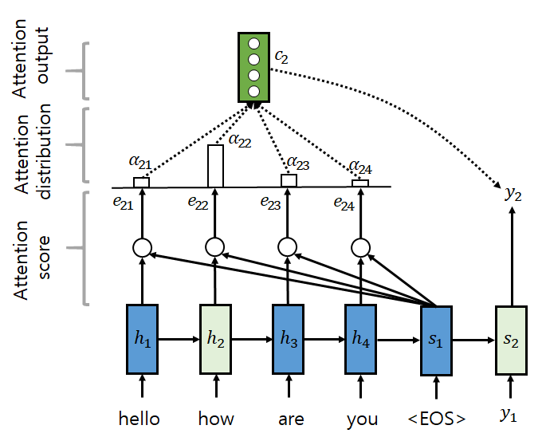
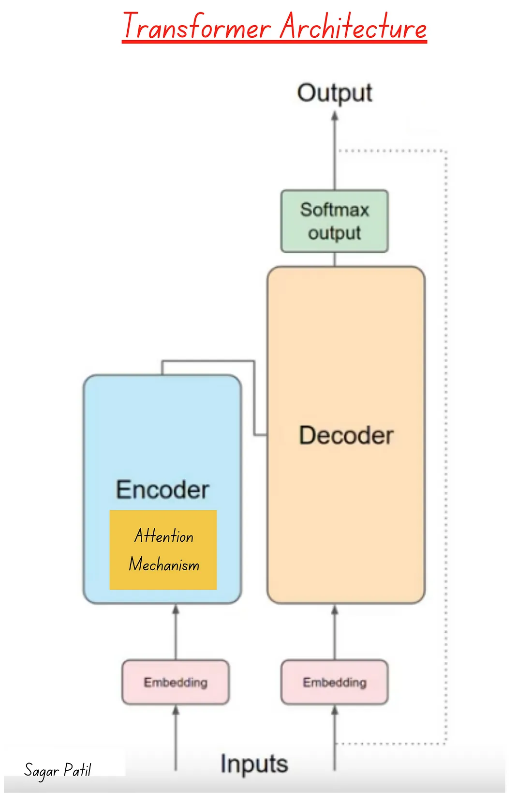
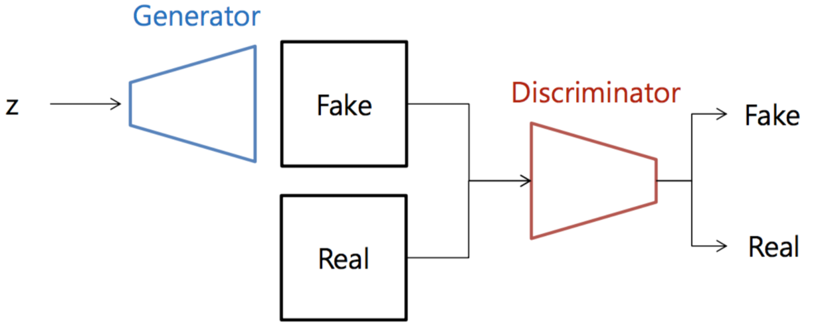

# 2. Generative AI
### 주어진 입력 데이터에서 새로운 데이터를 생성하는 인공 지능의 한 유형을 의미합니다. 이러한 모델은 데이터의 확률적인 분포를 학습하여 새로운 데이터를 생성하거나 변환할 수 있습니다. Generative AI는 생성 모델(Generative Model)이라고도 불립니다.

- 이미지 생성: Generative AI는 주어진 학습 데이터셋에서 새로운 이미지를 생성할 수 있습니다. 이를 통해 예술 작품 생성, 사진 변환, 이미지 합성 등의 작업에 활용될 수 있습니다.
- 음악 생성: Generative AI는 음악의 패턴을 학습하여 새로운 음악을 생성할 수 있습니다. 이를 통해 음악 작곡, 자동 음악 생성, 음악 스타일 변환 등의 작업에 사용될 수 있습니다.
- 자연어 생성: Generative AI는 자연어 처리 모델을 사용하여 텍스트 데이터를 생성할 수 있습니다. 이를 통해 문장 생성, 이야기 작성, 자동 요약 등의 작업에 사용될 수 있습니다.
- 영상 변환: Generative AI는 입력 이미지를 다른 스타일의 이미지로 변환하는 작업에 사용될 수 있습니다. 이를 통해 사진 스타일 변환, 흑백 이미지를 컬러 이미지로 변환 등의 작업을 수행할 수 있습니다.

### Generative AI는 주어진 데이터의 분포를 학습하여 새로운 데이터를 생성하거나 변환하는 데 사용되며, 다양한 분야에서 창의적인 작업을 수행

## 1. Attention
- 시퀀스 데이터를 처리하는 모델에서 특정 부분에 집중(attention)하거나 중요한 정보를 강조하는 데 사용됩니다.
- 세 가지 주요 구성 요소
  - 쿼리(Query): 주로 현재 처리 중인 시퀀스의 위치나 단어를 나타내는 벡터입니다. 
    - 쿼리는 일종의 키(key) 역할을 수행하여 주어진 문제에 따라 주의를 집중할 대상을 결정합니다.
  - 키(Key): 시퀀스의 다른 위치나 단어를 나타내는 벡터입니다. 
    - 이러한 키는 쿼리와 비교하여 얼마나 유사한지를 측정합니다.
  - 값(Value): Attention 메커니즘이 주의를 집중시킬 때 실제로 사용되는 정보입니다. 
    - 보통 이 값은 입력 시퀀스의 각 위치에서의 특정 정보를 나타냅니다.
- Attention은 쿼리와 키 간의 유사도를 계산한 후, 이 유사도를 사용하여 값에 가중치를 부여하여 조정합니다. 이렇게 함으로써 모델은 입력 시퀀스의 각 부분에 얼마나 집중해야 하는지를 학습
- Attention은 주로 Transformer와 같은 모델에서 사용됩니다. Transformer에서는 Self-Attention 메커니즘이 사용되어 입력 시퀀스 내의 모든 위치 간의 의존성을 효과적으로 모델링할 수 있습니다. 이러한 Attention 메커니즘의 사용은 Transformer 모델이 기존의 RNN이나 LSTM보다 긴 시퀀스에 대한 정보를 효과적으로 학습할 수 있도록 해주는 주요 요소 중 하나
- [Attention Mechanism (어텐션 메커니즘)](https://blog.naver.com/ckdgus1433/221608376139)
-  

## 2. Transformer
- 기존의 순환 신경망(RNN)과 LSTM(Long Short-Term Memory)과 같은 모델 대신에 self-attention 메커니즘을 사용하여 문장의 다양한 요소 간의 관계를 파악하고 이를 기반으로 문장을 이해하고 생성합니다.
  - Self-Attention 메커니즘: Transformer는 입력 문장의 모든 단어가 서로 상호작용할 수 있는 self-attention 메커니즘을 사용합니다. 이를 통해 각 단어의 중요도를 계산하고 문맥을 파악하여 문장을 처리합니다. 이러한 메커니즘은 문장의 장기 의존성을 효과적으로 학습할 수 있습니다.
  - 병렬 처리: 기존의 RNN과 LSTM은 순차적으로 처리되기 때문에 긴 문장에 대한 처리에 시간이 오래 걸릴 수 있습니다. 그러나 Transformer는 self-attention 메커니즘을 사용하여 문장을 동시에 처리할 수 있기 때문에 병렬 처리가 가능합니다.
  - Positional Encoding: Transformer는 단어의 위치 정보를 유지하기 위해 positional encoding을 사용합니다. 이를 통해 모델은 단어의 상대적인 위치에 따른 정보를 파악할 수 있습니다.
  - Layer Normalization: Transformer는 각 층의 출력을 정규화하여 학습을 안정화하는 Layer Normalization을 사용합니다.
  - Feed-Forward Neural Network: Transformer의 각 층에는 다층 퍼셉트론(Feed-Forward Neural Network)이 있습니다. 이를 통해 각 단어의 표현을 변환하고 다음 층으로 전달합니다.
- 기존 대비 더 나은 성능과 학습 효율을 제공
  - Self-Attention 메커니즘의 도입:
    - Transformer는 self-attention 메커니즘을 사용하여 문장 내의 모든 단어 간의 관계를 파악합니다. 이는 기존의 RNN과 LSTM에서 발생할 수 있는 시간적인 의존성 문제를 해결하고, 더 넓은 문맥을 이해할 수 있도록 합니다.
    - Self-attention은 각 단어가 다른 모든 단어와의 관계를 고려할 수 있으므로, 번역, 요약, 문장 생성 등의 작업에 효과적입니다.
  - 병렬 처리 가능성:
    - Transformer는 self-attention 메커니즘을 사용하기 때문에 각 단계에서의 연산이 병렬 처리될 수 있습니다. 이는 학습과 추론 과정에서의 속도를 향상시키는 데 중요한 역할을 합니다.
    - 반면에 RNN은 순차적으로 진행되기 때문에 병렬 처리가 어렵고, 학습 및 추론 속도가 느릴 수 있습니다.
  - Long-Range Dependency 학습:
    - Transformer는 self-attention 메커니즘을 사용하여 장거리 의존성(long-range dependency)을 학습할 수 있습니다. 이는 문장 내에서 먼 위치에 있는 단어들 간의 관계를 파악하는 데 유리하며, 번역이나 문장 생성과 같은 작업에 유용합니다.
    - 반면에 RNN은 장기 의존성을 학습하는 데 제한이 있을 수 있습니다.
  - 메모리 사용량의 감소:
    - Transformer는 각 단어 간의 관계를 계산할 때 고정된 크기의 메모리만 사용하므로, 입력 시퀀스의 길이에 상관없이 일정한 메모리를 사용합니다.
    - 이는 매우 긴 시퀀스에 대한 처리에 유리하며, RNN이나 LSTM보다 더 많은 메모리를 효율적으로 사용할 수 있습니다.
- 
- [Attention Mechanism in the Transformers](https://medium.com/@sagarpatiler/attention-mechanism-in-the-transformers-fd067df25ea)

## 3. GAN (적대적 생성신경망)

## 4. Multi modal
- 여러 종류의 입력 데이터를 동시에 다루는 기술입니다. 
- 오디오, 이미지, 텍스트 등 다양한 종류의 데이터를 한꺼번에 처리하고 이를 기반으로 새로운 데이터를 생성하는 데 사용.
- 다양한 모달리티의 데이터를 동시에 고려함으로써 더 풍부하고 의미 있는 결과물을 생성.
  - 다양한 데이터 형식 지원: 이미지, 텍스트, 오디오 등 다양한 종류의 데이터를 동시에 처리할 수 있습니다.
  - 상호 작용적 학습: 각각의 모달리티 간의 상호 작용을 고려하여 데이터를 분석하고 학습합니다. 이를 통해 다양한 종류의 데이터 간의 관계를 더 잘 이해하고 모델을 개선할 수 있습니다.
  - 통합된 표현 학습: 여러 모달리티의 데이터를 통합하여 표현을 학습하고, 이를 기반으로 새로운 데이터를 생성합니다. 이는 다양한 종류의 정보를 결합하여 더 풍부하고 의미 있는 결과물을 생성하는 데 도움이 됩니다.
  - 다양한 응용 분야: Multi-modal 생성형 인공지능은 이미지 캡션 생성, 자유로운 이미지 생성, 오디오 설명 생성 등 다양한 응용 분야에 사용될 수 있습니다.

## 5. Large Language Model
- 대규모 텍스트 데이터를 사용하여 학습되는 언어 모델
- 딥러닝 및 자연어 처리 분야에서 널리 사용되며, 많은 경우 기계 번역, 문장 생성, 텍스트 분류 등의 작업에 활용
  - 대규모 데이터 학습: LLM은 대량의 텍스트 데이터를 사용하여 학습되므로, 많은 양의 데이터를 필요로 합니다. 이를 통해 모델은 보다 다양한 언어 패턴과 문법을 학습할 수 있습니다.
  - 문맥을 고려한 언어 이해: LLM은 입력된 텍스트의 문맥을 이해하고 다음 단어를 예측하는 데 사용됩니다. 따라서 모델은 문장이나 문서 전체의 의미를 파악하고 적절한 답변이나 문장을 생성할 수 있습니다.
  - 다양한 언어 작업에 적용 가능: LLM은 번역, 요약, 질문 응답, 자연어 이해 등 다양한 언어 작업에 사용될 수 있습니다. 또한, LLM은 다른 언어로 작성된 텍스트에 대해서도 적용될 수 있습니다.
  - Fine-tuning 가능: LLM은 미세 조정(fine-tuning)을 통해 특정 작업에 적합하도록 개조될 수 있습니다. 즉, 미리 학습된 LLM을 특정 작업에 맞게 조정하여 높은 성능을 달성할 수 있습니다.

- GPT(Generative Pre-trained Transformer)
  - Transformer Architecture: 
    - GPT 모델은 Transformer 아키텍처를 기반으로 합니다. 이는 Self-Attention 메커니즘과 Feedforward Neural Network를 사용하여 문맥을 파악하고 출력을 생성합니다. 
    - Transformer는 Encoder-Decoder 구조를 사용하지만, GPT에서는 Decoder만 사용하여 문맥을 이해하고 문장을 생성합니다.
  - Layer Stacking: 
    - GPT 모델은 여러 층의 Transformer 인코더를 쌓아올린 형태로 구성됩니다. 
    - 각 층은 서로 다른 수준의 추상화를 담당하며, 입력 문장의 다양한 측면을 고려하여 문맥을 이해합니다.
  - Self-Attention Mechanism:
    - GPT 모델은 Self-Attention 메커니즘을 사용하여 입력 문장의 각 단어 간의 관계를 파악합니다. 
    - 이를 통해 모델은 문장의 다양한 부분을 고려하여 문맥을 이해하고 적절한 출력을 생성합니다.
  - [GPT1](www.cs.ubc.ca/~amuham01/LING530/papers/radford2018improving.pdf)
  - [GPT2](d4mucfpksywv.cloudfront.net/better-language-models/language-models.pdf)
  - [GPT3](arxiv.org/abs/2005.14165)
 
- GEMINI
  -  구조: 
    - GEMINI는 GPT와 유사한 Transformer 아키텍처를 기반으로 합니다. 
    - 그러나 GEMINI는 단일 모델로 하나의 예측 과제에 집중하는 대신, 여러 예측 과제를 함께 수행할 수 있는 멀티모달 (multi-modal) 모델입니다. 이는 이미지, 텍스트, 오디오 등 다양한 종류의 입력 데이터를 처리할 수 있습니다.
  - 멀티모달 기능: 
    - GEMINI는 여러 종류의 입력 데이터를 처리하고 이를 기반으로 다양한 예측 과제를 수행할 수 있습니다. 
    - 예를 들어, 이미지와 텍스트를 함께 입력으로 받아 문장을 생성하거나, 오디오와 텍스트를 함께 처리하여 다양한 자연어 처리 작업을 수행할 수 있습니다.
  - 적용 분야: 
    - GEMINI는 멀티모달 데이터 처리가 필요한 다양한 응용 분야에 적용될 수 있습니다. 
    - 이는 자율 주행 자동차, 음성 기반 인터페이스, 멀티모달 검색 등 다양한 분야에서 활용될 수 있습니다.

- GPT-3는 대규모 텍스트 데이터를 기반으로 한 대규모 언어 모델이며, GEMINI는 멀티모달 기능을 갖춘 자연어 처리 모델입니다. 
- GPT-3는 텍스트에 초점을 맞춘 반면, GEMINI는 다양한 종류의 입력 데이터를 함께 처리할 수 있는 기능을 제공
- [구글 제미니가 오픈API GPT-4를 압도할까?](https://brunch.co.kr/@delight412/611)

## 6. Large Vision Model
- 딥러닝 기반의 모델로 구성되며, 대규모의 이미지 데이터셋을 사용하여 사전 훈련된(pre-trained)된 형태로 제공됩니다. 이 모델들은 많은 수의 계층(layer)과 매개변수를 가지고 있어, 복잡한 이미지 특징을 학습하고 다양한 시각적 작업을 수행할 수 있습니다.
- 일반적으로 Large Vision Model은 다음과 같은 주요 작업을 수행할 수 있습니다:
  - 이미지 분류(Image Classification): 입력 이미지를 다양한 클래스로 분류하는 작업을 수행합니다. 예를 들어, 고양이, 개, 자동차 등의 클래스로 이미지를 분류할 수 있습니다.
  - 객체 감지(Object Detection): 이미지 내에서 특정 객체의 위치와 경계 상자를 찾아내는 작업을 수행합니다. 이를 통해 이미지 내에 있는 여러 객체를 동시에 감지하고 식별할 수 있습니다.
  - 시멘틱 분할(Semantic Segmentation): 이미지를 픽셀 수준에서 분류하여 각 픽셀이 어떤 클래스에 속하는지를 결정합니다. 이를 통해 이미지의 각 구성 요소를 더 세분화하여 분석할 수 있습니다.
  - 사전 훈련 및 전이 학습(Pre-training and Transfer Learning): 대규모 이미지 데이터셋에서 사전 훈련된 Large Vision Model은 특정 작업에 대해 더 빠르고 정확한 학습을 제공합니다. 이러한 모델은 전이 학습을 통해 다른 작업에도 쉽게 적용될 수 있습니다.
- 대표적인 Large Vision Model로는 VGG, ResNet, Inception, EfficientNet 등이 있으며, 이러한 모델들은 현재 컴퓨터 비전 분야에서 널리 사용되고 있습니다.